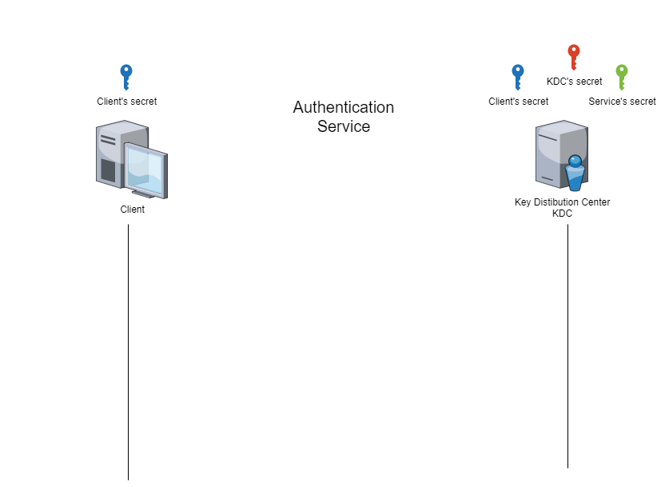
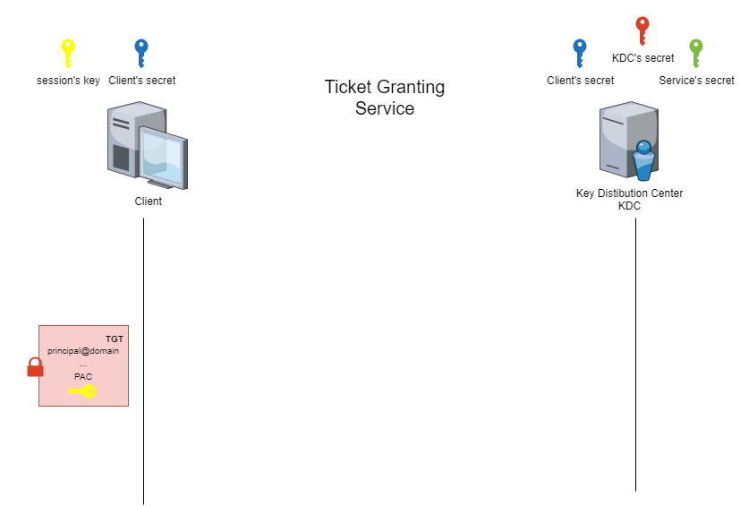
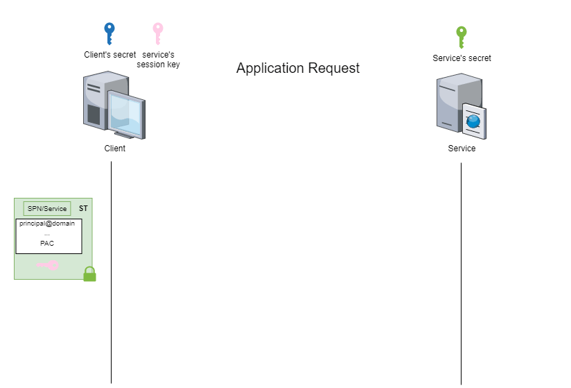

# Authentication Service (AS)

# Ticket-Granting Service (TGS)

# Application Request (AP)

# Acknowledgments
Special thanks to Benoit PHILIPPE, Pentester at Vaadata, for providing the informative illustrations of the various phases of the Kerberos protocol. These visuals significantly enhance the understanding of this essential security protocol.
